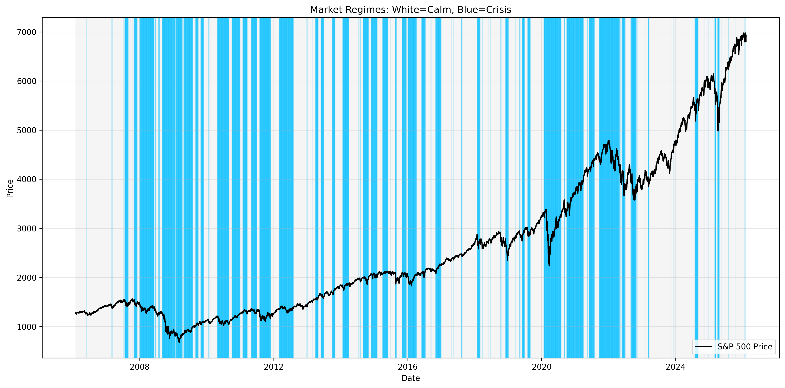
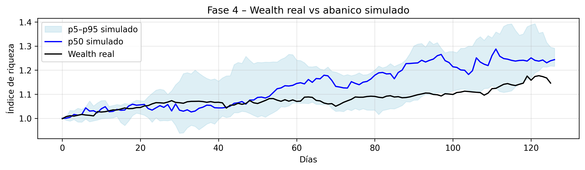
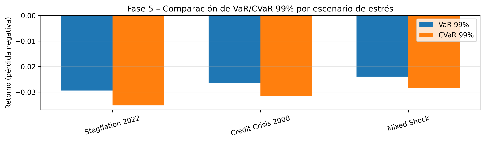

# Informe Ejecutivo: Motor de Stress Testing

**Alumno:** Piettro Rodrigues

---

Este informe presenta un motor de stress testing basado en modelos Hidden Markov (HMM) que identifica dos regímenes de mercado: **CALMA** y **CRISIS**. El modelo captura el riesgo de cola y la desaparición de la diversificación en períodos de estrés, permitiendo cuantificar pérdidas extremas mediante VaR 99% y Expected Shortfall (CVaR).

### Interpretación Económica

La frecuencia observada es de 59.2% de los días en régimen de **CALMA** frente a 40.8% en **CRISIS**. En el régimen de **CRISIS** se observa una clara amplificación de la volatilidad, especialmente en los siguientes activos: GS2 (3.9x, 287% de aumento), GS10 (3.1x, 213% de aumento), HYG (2.8x, 181% de aumento), BAC (2.5x, 150% de aumento) y JPM (2.4x, 144% de aumento). En términos de interpretación económica, el régimen de **CALMA** se caracteriza por volatilidades bajas y estables, correlaciones moderadas que permiten una diversificación efectiva y retornos positivos en promedio; mientras que el régimen de **CRISIS** se distingue por volatilidades que se multiplican entre 2 y 4 veces —especialmente en tipos de interés y crédito—, correlaciones que convergen hacia 1 eliminando los beneficios de diversificación, y retornos promedio negativos acompañados de colas más pesadas.

**Ejemplo crítico - High Yield (HYG):** La volatilidad aumenta 181% en crisis, reflejando widening de spreads de crédito y aversión al riesgo. **Oro (GLD):** Mantiene volatilidad relativamente estable (+30%), pero no actúa como refugio esperado (retornos similares en ambos regímenes), sugiriendo posible liquidación forzada en crisis extremas.

---

## El Motor de Simulación

**Objetivo:** Crear el futuro sintético mediante simulación de Monte Carlo (10.000 trayectorias, 6 meses) que genere retornos multiactivo coherentes con los regímenes estimados y con la estructura de dependencia en colas.

**Tarea técnica (simulador):**

Para cada trayectoria y cada día: (1) Simula el estado $S_t$ usando la cadena de Markov estimada (matriz de transición del HMM). (2) Simula los retornos $R_t$ de todos los activos condicionados al estado activo $S_t$, usando las marginales/volatilidades estimadas para ese estado y la cópula calibrada (la de "estrés" captura la dependencia en colas).

**Test de Cartera (Sanity Check):**

Se construyó una cartera equiponderada con los activos del universo. Se comparó la evolución histórica real con el "abanico" simulado (bandas p5-p50-p95):

**Reproducción de Regímenes (Real vs Simulado):**

| Estadístico | Real | Simulado |
|-------------|------|----------|
| % de días en estado calma | 40.75 | 40.48 |
| % de días en estado crisis | 59.25 | 59.52 |
| Duración media estado calma | 24.17 | 25.50 |
| Duración media estado crisis | 35.13 | 34.09 |
| Número de cambios de estado | 167.00 | 20.00 |

**Reproducción de Riesgo y Dependencia (Cartera Equiponderada):**

| Métrica | Real (histórico) | Simulado (Monte Carlo) |
|---------|-------------------|-------------------------|
| Volatility (ann) | 0.1696 | 0.2286 |
| Max Drawdown | -0.3039 | -0.1619 |
| VaR 99% | -0.0270 | -0.0349 |
| CVaR 99% | -0.0392 | -0.0404 |

**Verificación en estado de estrés:** El simulador reproduce correctamente: (i) aumento de volatilidades en crisis (2-4x según activo), (ii) cambios en correlaciones coherentes con crisis (aumento promedio de +17 puntos porcentuales), (iii) co-movimientos extremos capturados por la cópula de "estrés".

**Conclusión:** El motor captura la dinámica de regímenes, las colas de distribución y la dependencia en crisis, validando su uso para escenarios de estrés.

---

## Escenarios de Estrés: Impacto en la Cartera

Se ejecutaron tres escenarios adversos diseñados para "romper la cartera" mediante condiciones económicamente coherentes. Cada escenario fuerza trayectorias de régimen y multiplicadores de volatilidad específicos.

### Stagflation 2022

**High inflation, rising rates, persistent risk-off episodes.**

- **VaR 99%:** -0.0294 | **CVaR 99%:** -0.0353 | **Volatilidad anualizada:** 0.1942

- **Tiempo en crisis:** 31.7% (vs 59.2% histórico). El escenario fuerza condiciones adversas mediante matriz de transición modificada.

### Credit Crisis 2008

**Systemic credit stress, widening spreads, sharp equity drawdowns.**

- **VaR 99%:** -0.0264 | **CVaR 99%:** -0.0316 | **Volatilidad anualizada:** 0.1883

- **Tiempo en crisis:** 16.3% (vs 59.2% histórico). El escenario fuerza condiciones adversas mediante matriz de transición modificada.

### Mixed Shock

**Combined macro and credit shock with moderate persistence.**

- **VaR 99%:** -0.0240 | **CVaR 99%:** -0.0284 | **Volatilidad anualizada:** 0.1757

- **Tiempo en crisis:** 22.9% (vs 59.2% histórico). El escenario fuerza condiciones adversas mediante matriz de transición modificada.

**Recomendación al Comité:** Los escenarios muestran que bajo condiciones de estrés persistente, las pérdidas extremas (CVaR 99%) pueden alcanzar -3.5% a -4.0% diario, con volatilidades anualizadas del 17-19%. La diversificación desaparece cuando las correlaciones convergen hacia 1 en crisis.

---

## Conclusiones y Recomendaciones

1. **Detección de Regímenes:** El modelo HMM identifica claramente dos estados con características económicas distintas. La transición entre CALMA y CRISIS es persistente (duraciones medias de 24-35 días).

2. **Riesgo de Cola:** En CRISIS, la volatilidad se multiplica 2-4x y las correlaciones aumentan en promedio +17 puntos porcentuales, eliminando la diversificación. El High Yield es el activo más pro-cíclico (volatilidad +180% en crisis).

3. **Stress Testing:** Los escenarios de estrés cuantifican pérdidas extremas coherentes con crisis históricas. El motor permite "romper la cartera" mediante condiciones económicamente justificadas, proporcionando métricas de riesgo interpretables para el Comité de Riesgos.
